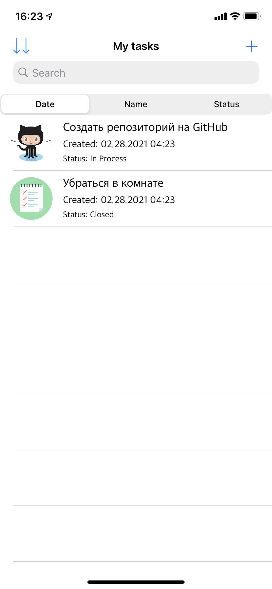
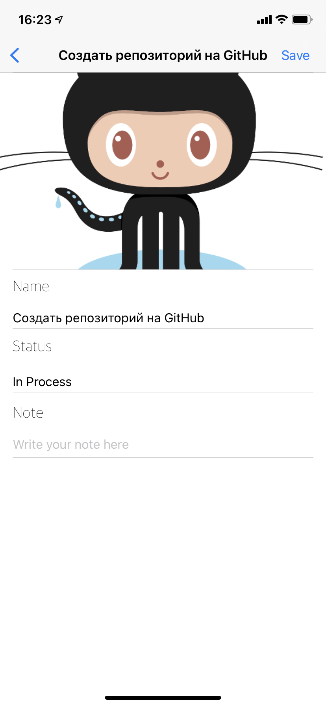
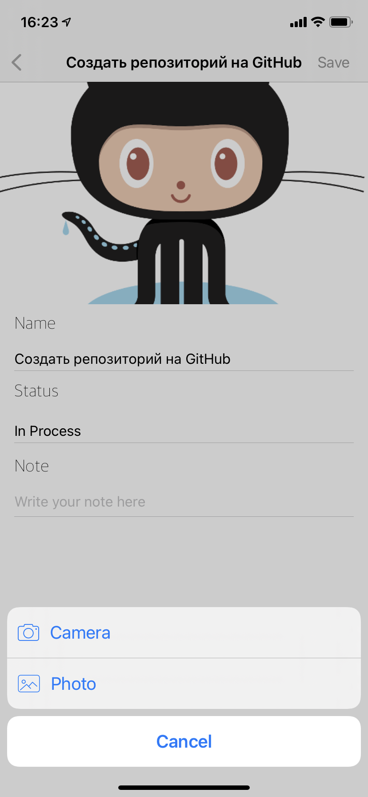
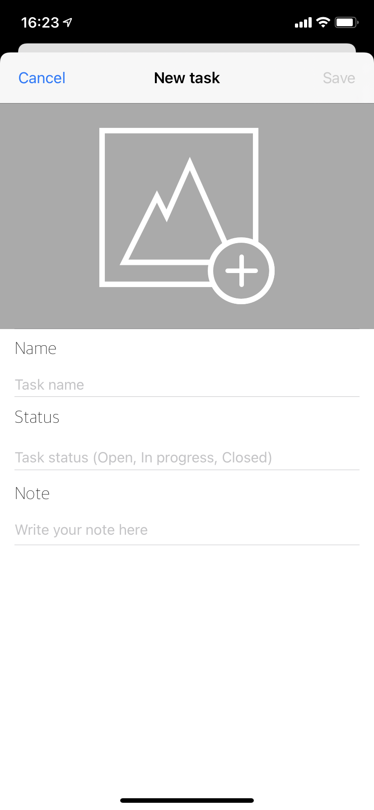

# myTasks
Simple ToDoList app. With a function of adding, deleting and editing existing tasks. Also tasks could be created with custom pictures.
Using **Realm & UIKit.** 

# Скриншоты

## So, here is the main screen.

## This is the screen to add new task by tapping an add button. Also you can edit existing tasks by tapping tasks's cell.

      
## You are also able to add/change task's photo using your camera or photo library.

        
## Here is the screen of empty task

